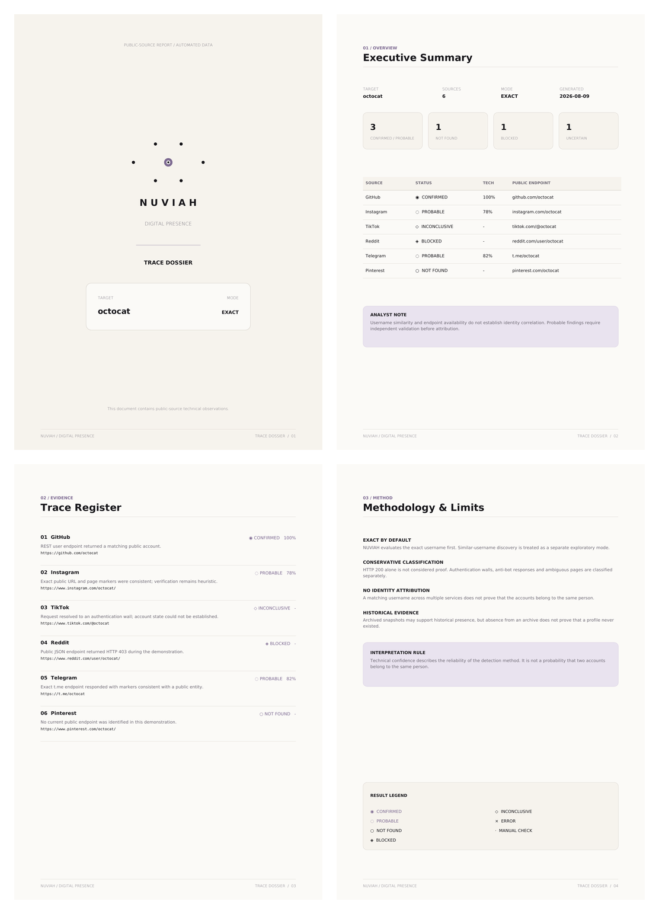

<div align="center">

  <picture>
    <source media="(prefers-color-scheme: dark)" srcset="docs/assets/nuviah-header-dark.svg">
    <source media="(prefers-color-scheme: light)" srcset="docs/assets/nuviah-header-light.svg">
    
  </picture>

  <p><strong>Conservative public-username trace analysis across online sources.</strong></p>
  <p><em>Exact by default. Exploratory by choice.</em></p>

  <p>
    
    
    
    
    
    
  </p>

</div>

NUVIAH is a Bash-based OSINT utility for evaluating the current public presence of a username across multiple online platforms. It combines source-specific API, JSON, HTML, and manual verification methods with conservative classification, optional similar-username discovery, public historical snapshot checks, and structured reporting.

> [!IMPORTANT]
> A matching or similar username does **not** establish that accounts belong to the same person. NUVIAH reports technical endpoint evidence; identity attribution remains outside the scope of automated scanning.

**Current stable release:** `v1.0.5`
**Creator and copyright holder:** [Nebra0x](https://github.com/Nebra0x)  

## Contents

- [Core principles](#core-principles)
- [Features](#features)
- [Supported sources](#supported-sources)
- [Result model](#result-model)
- [Requirements](#requirements)
- [Installation](#installation)
- [Quick start](#quick-start)
- [CLI reference](#cli-reference)
- [Reports](#reports)
- [Similar username discovery](#similar-username-discovery)
- [Historical traces](#historical-traces)
- [Built-in safeguards](#built-in-safeguards)
- [Testing](#testing)
- [Methodology and known limitations](#methodology-and-known-limitations)
- [Responsible use](#responsible-use)
- [License and commercial use](#license-and-commercial-use)
- [Project status](#project-status)
- [Disclaimer](#disclaimer)

## Core principles

### Exact by default

NUVIAH evaluates the exact username first. Similar-username discovery is a separate exploratory mode that must be enabled explicitly.

### Conservative classification

An HTTP `200` response alone is not proof. Authentication walls, redirects, rate limits, anti-bot pages, ambiguous content, unsupported methods, and unexpected responses are classified separately.

### No identity attribution

A matching username across different services does not establish common ownership or identity correlation.

### Evidence-aware reporting

Technical confidence describes the reliability of the detection method. It is **not** the probability that two accounts belong to the same person.

## Features

- Exact username analysis across **12 configured sources**.
- Source-specific Strong API, API/JSON, heuristic, limited, and manual verification methods.
- Conservative visual classification with explainable reasons in generated reports.
- Optional controlled username-variant discovery.
- Optional public Wayback snapshot availability checks.
- TXT, CSV, JSON, and branded PDF reporting.
- Dynamically centered terminal branding and English-language CLI output.
- Configurable request budget, delay, timeout, and response-size controls.
- Optional authenticated GitHub API requests through `GITHUB_TOKEN`.
- Built-in dependency diagnostics and offline self-tests.
- Private report permissions by default.

## Supported sources

| Key | Platform | Method | Similar | History | Important limitation |
|---|---|---|:---:|:---:|---|
| `instagram` | Instagram | Heuristic | Yes | Yes | Login walls and anti-bot protections may prevent reliable verification. |
| `tiktok` | TikTok | Heuristic | Yes | Yes | Dynamic content and mandatory-login redirects may produce `INCONCLUSIVE`. |
| `github` | GitHub | Strong API | Yes | Yes | Uses GitHub's public REST user endpoint. |
| `youtube` | YouTube | Heuristic | Yes | Yes | Public-handle verification remains heuristic without an API key. |
| `x` | X / Twitter | Heuristic | Yes | Yes | Login redirects and JavaScript-rendered pages are common. |
| `snapchat` | Snapchat | Heuristic | Yes | Yes | A Public Profile is optional; a negative public result does not rule out an account. |
| `discord` | Discord | Manual | No | No | Reliable public username-only enumeration is unavailable. |
| `reddit` | Reddit | API / JSON | Yes | Yes | The public JSON endpoint may return access restrictions such as HTTP `403`. |
| `linkedin` | LinkedIn | Heuristic — limited | No | Yes | Automated requests may be restricted, including non-standard responses such as HTTP `999`; manual review may be required. |
| `pinterest` | Pinterest | Heuristic | Yes | Yes | Private profiles may not be publicly verifiable. |
| `telegram` | Telegram | Heuristic | Yes | Yes | A `t.me` endpoint may represent a user, group, channel, or bot. |
| `bereal` | BeReal | Manual | No | No | Reliable username lookup is performed inside the application. |

Display the platform table implemented by the installed version:

```bash
./nuviah.sh --list-platforms
```

> [!NOTE]
> Coverage is not confidence. A broad source list does not imply that every platform can be verified with equal reliability.

## Result model

```text
◉  CONFIRMED
◌  PROBABLE
○  NOT FOUND
◈  BLOCKED
◇  INCONCLUSIVE
×  ERROR
·  MANUAL CHECK
```

| Result | Meaning |
|---|---|
| `CONFIRMED` | Strong technical evidence confirms the current public endpoint. |
| `PROBABLE` | Evidence suggests a match, but verification remains heuristic. |
| `NOT FOUND` | No current public endpoint was verified. This does not mean the username never existed. |
| `BLOCKED` | Authentication, rate limiting, access controls, or anti-bot protections prevented verification. |
| `INCONCLUSIVE` | The available evidence is insufficient for reliable classification. |
| `ERROR` | A network, DNS, timeout, transfer, or processing error occurred. |
| `MANUAL CHECK` | Reliable automated username-only verification is unavailable. |

Show the legend at any time:

```bash
./nuviah.sh --legend
```

## Requirements

### Required

- Linux
- Bash 4 or later
- `curl`
- Python 3.9 or later

### Optional

- ReportLab for PDF generation

On Kali Linux or another Debian-based distribution:

```bash
sudo apt update
sudo apt install -y curl python3 python3-reportlab
```

ReportLab is required only for `--pdf` and `--all-formats`.

## Installation

### 1. Clone the repository

Use the HTTPS clone URL displayed by GitHub:

```bash
git clone https://github.com/Nebra0x/nuviah.git
cd nuviah
```

### 2. Make the launcher executable

```bash
chmod 755 nuviah.sh
```

### 3. Check the environment

```bash
./nuviah.sh --check-deps
```

### 4. Run the offline test suite

```bash
./nuviah.sh --self-test
```

A successful installation ends with:

```text
All offline tests passed.
```

### Optional: install as a user command

```bash
mkdir -p ~/.local/bin
install -m 755 nuviah.sh ~/.local/bin/nuviah
grep -qxF 'export PATH="$HOME/.local/bin:$PATH"' ~/.zshrc || \
  echo 'export PATH="$HOME/.local/bin:$PATH"' >> ~/.zshrc
source ~/.zshrc
```

Kali uses Zsh by default. Bash users can apply the equivalent `PATH` line to `~/.bashrc`.

Then run NUVIAH from any directory:

```bash
nuviah --version
nuviah -h
```

Do **not** run NUVIAH with `sudo`; elevated privileges are not required.

## Quick start

Exact scan across all configured sources:

```bash
./nuviah.sh scan octocat
```

Selected sources:

```bash
./nuviah.sh scan octocat --platforms "github,reddit,telegram"
```

Generate every report format:

```bash
./nuviah.sh scan octocat \
  --platforms "github,reddit,telegram" \
  --all-formats \
  --output-dir reports
```

Illustrative output:

```text
Target:      octocat
Sources:     github,reddit,telegram
Mode:        EXACT

[01/03] GitHub          ◉  CONFIRMED      100%  https://github.com/octocat
[02/03] Reddit          ◈  BLOCKED           —   https://www.reddit.com/user/octocat/
[03/03] Telegram        ◌  PROBABLE         82%  https://t.me/octocat

SCAN COMPLETE
```

## CLI reference

### General commands

| Command | Description |
|---|---|
| `-h`, `--help` | Show complete CLI help. |
| `help scan`, `scan --help` | Show scan-specific help. |
| `-V`, `--version` | Show the installed NUVIAH version. |
| `--legend` | Show the result legend. |
| `--list-platforms` | List platforms and verification methods. |
| `--check-deps` | Check required and optional dependencies. |
| `--self-test` | Run the built-in offline diagnostic suite. |

### Scan options

| Option | Description | Default |
|---|---|---:|
| `-p, --platforms <list>` | Select a comma-separated source list. | All sources |
| `--all` | Explicitly select every configured source. | — |
| `--similar` | Enable conservative username-variant discovery. | Disabled |
| `--similarity-threshold <N>` | Minimum textual similarity from 70 to 100. | `88` |
| `--max-variants <N>` | Maximum generated variants from 1 to 25. | `6` |
| `--history` | Query public Wayback snapshot availability. | Disabled |
| `--discord-id <ID>` | Add a manual Discord profile link for a known numeric ID. | — |

### Report options

| Option | Description |
|---|---|
| `--csv` | Generate CSV in addition to the default TXT report. |
| `--json` | Generate JSON in addition to the default TXT report. |
| `--pdf` | Generate PDF in addition to the default TXT report. |
| `--all-formats` | Generate TXT, CSV, JSON, and PDF. |
| `--no-txt` | Disable the default TXT report. |
| `-o, --output-dir <dir>` | Select the report directory. Default: `./nuviah-reports`. |

### Network and interface options

| Option | Description | Default |
|---|---|---:|
| `--timeout <sec>` | Total request timeout from 2 to 120 seconds. | `12` |
| `--connect-timeout <sec>` | Connection timeout from 1 to 60 seconds. | `5` |
| `--delay <ms>` | Delay between requests from 0 to 10000 ms. | `350` |
| `--max-requests <N>` | Maximum HTTP request budget. | `150` |
| `--user-agent <string>` | Override the default User-Agent. | NUVIAH default |
| `--no-color` | Disable ANSI colors. | Disabled |
| `--no-banner` | Hide the NUVIAH banner. | Disabled |
| `-q, --quiet` | Show only summaries and report paths. | Disabled |
| `--debug` | Show diagnostic information without exposing tokens. | Disabled |

The installed CLI is the source of truth:

```bash
./nuviah.sh --help
```

## Reports

TXT is generated by default. Additional formats are enabled explicitly.

| Format | Purpose |
|---|---|
| TXT | Human-readable scan and evidence record. |
| CSV | Tabular export for spreadsheets and further analysis. |
| JSON | Structured output for automation and programmatic processing. |
| PDF | Branded trace dossier with an executive summary, evidence register, methodology, and result legend. |

Generated files are written to `./nuviah-reports` unless another directory is selected with `--output-dir`.

<p align="center">
  
</p>

[Open the demonstration PDF](examples/NUVIAH_Sample_Dossier.pdf)

Only demonstration or intentionally public test data should be committed to the repository. Do not publish operational reports containing personal research data.

## Similar username discovery

Similar-username analysis is disabled by default and must be enabled with `--similar`.

```bash
./nuviah.sh scan example \
  --similar \
  --similarity-threshold 88 \
  --max-variants 6
```

NUVIAH generates a limited set of controlled candidates and assigns a textual similarity score. Similar candidates are reported separately from exact matches.

A similar username is only a **candidate**. Similarity does not establish account ownership, identity correlation, or attribution.

## Historical traces

The `--history` option checks public Wayback snapshot availability for supported endpoints.

```bash
./nuviah.sh scan octocat --platforms github --history
```

Historical results may show that a URL was publicly archived. They do not independently prove:

- account deletion;
- username renaming;
- suspension;
- continuous ownership;
- identity attribution.

A missing snapshot does not prove that a profile never existed. Internet Archive may also return rate limits such as HTTP `429`; NUVIAH classifies unavailable or insufficient historical evidence conservatively as `INCONCLUSIVE`.

Avoid repeatedly retrying a rate-limited historical request.

## Optional GitHub token

GitHub checks work without a token. An optional token can be supplied through the environment:

```bash
export GITHUB_TOKEN='YOUR_TOKEN'
./nuviah.sh scan octocat --platforms github
unset GITHUB_TOKEN
```

Do not place tokens inside the script, commit them to Git, include them in screenshots, or store them in example reports.

## Built-in safeguards

NUVIAH includes operational controls intended to reduce unsafe or misleading behavior:

- strict Bash execution with `set -Eeuo pipefail`;
- private file permissions through `umask 077`;
- temporary-directory cleanup on normal exit and termination;
- maximum response body size of 8 MiB per request;
- configurable request budget, delay, and timeouts;
- conservative classification of login walls, anti-bot responses, and ambiguous pages;
- no automatic privilege elevation;
- no password attempts, exploitation, port scanning, or authentication bypass;
- optional GitHub token isolation from child-process environments.

These controls reduce risk but do not replace responsible operator judgment.

## Testing

Run the complete offline diagnostic suite:

```bash
./nuviah.sh --self-test
```

The suite checks:

- Bash syntax;
- core dependencies;
- username-variant generation;
- platform-specific validation;
- negative marker detection;
- authentication-wall detection;
- conservative status presentation;
- help and legend commands;
- TXT, CSV, and JSON generation;
- PDF generation when ReportLab is installed.

Standalone syntax check:

```bash
bash -n nuviah.sh
```

## Methodology and known limitations

NUVIAH combines several verification methods because platforms do not expose username presence consistently.

- **Strong API:** a structured public endpoint returns an exact username response.
- **API / JSON:** a structured endpoint is available but may still enforce access restrictions.
- **Heuristic:** URL structure, HTTP status, redirects, authentication walls, and page markers are evaluated conservatively.
- **Heuristic — limited:** automated verification is technically unreliable or frequently restricted; manual review may be required.
- **Manual:** reliable automated username-only verification is unavailable.

Known limitations include:

- HTML structures, redirects, and marker text may change without notice.
- JavaScript-rendered pages may not expose enough evidence to `curl`.
- Anti-bot systems may return `403`, `429`, non-standard codes such as LinkedIn `999`, or login walls.
- Telegram endpoints do not by themselves establish whether the entity is a user, bot, channel, or group.
- Snapchat absence does not rule out an account without a Public Profile.
- Discord and BeReal remain manual sources.
- Wayback availability is incomplete and may be rate-limited.

A `CONFIRMED` result confirms technical endpoint evidence only. It does not confirm the identity of the account owner.

## Responsible use

Use NUVIAH only with publicly accessible data and in lawful, authorized contexts.

Do not use the project to:

- bypass authentication or technical access controls;
- evade CAPTCHA, rate limits, or anti-bot protections;
- access private accounts or restricted data;
- harass, stalk, threaten, impersonate, or expose individuals;
- present username similarity as proof of identity;
- publish personal-data reports without a legitimate and appropriate purpose.

The operator is responsible for complying with applicable laws, platform terms, professional standards, and data-protection requirements.

## License and commercial use

Copyright © 2026 **Nebra0x**. All rights reserved except as expressly granted under the repository license.

NUVIAH is intended to be distributed as **source-available software** under the [PolyForm Strict License 1.0.0](https://polyformproject.org/licenses/strict/1.0.0).

Under the public license, users may run the unmodified official software for permitted noncommercial purposes. The public license does not authorize modification, redistribution, resale, sublicensing, or commercial use.

Any commercial use or other use outside the public license requires prior written authorization from **Nebra0x**, the copyright holder.

Because the public license restricts modification, redistribution, and commercial use, NUVIAH is **source-available**, not OSI-approved open-source software.

The repository must include the complete official license text in a root-level `LICENSE` file. The license file governs; this README is only a practical summary.

## Project status

`v1.0.5` is the current stable release.

The present priority is stability, documentation, reproducible testing, and accurate limitations—not feature expansion. Future changes should be driven by verified bugs or clear operational requirements.

## Disclaimer

NUVIAH is provided for educational, defensive, research, and authorized OSINT use. Results may be incomplete, blocked, outdated, or ambiguous. No automated result should be treated as definitive identity attribution without independent validation. The software is provided without warranties to the extent permitted by the applicable license.
